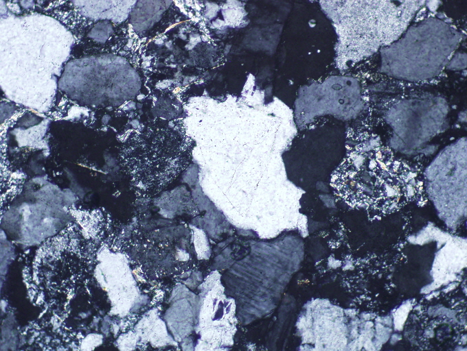

# ThinGPT: describing rock thin section images with a multimodal large language model
- Petroleum Science

## Project profile
The proposed project is based on the CLIP model and GPT2, drawing on the ideas of CLIPCAP and the network foundation framework, which aims to generate long text descriptions for rock flakes. It is worth noting that the results of the model generation are in both Chinese and English. Since the data set I used was in Chinese, the pre-trained model provided was also generated in Chinese. If you need to generate the English version directly, then the data set can be replaced in English.



Chinese result
```
0245.jpg	鉴定结果是泥质呈纤维状、隐晶状等，大部分已绢云母化，分布欠均。硅质围绕颗粒分布。长石具粘土化或绢云母化。少见石、石、电气石、石、白钛矿等。碎屑长轴大致具定向性。砾石英砾石5%，呈次椭圆状，呈次为2-4.	鉴定结果是泥质呈纤维状、隐晶状等，大部分已绢云母化，分布较均，局部地方解石呈粉晶-细晶状，含铁。白云石呈粉晶-连晶状，含铁。硅质围绕颗粒分布。长石具粘土化或绢云母化。少见锆石、电气石、电气石、白钛矿等。
```
English result
```
0245.jpg  The identification results showed that the mud was fibrous, cryptocrystalline, etc., most of which had been sericitized and the distribution was uneven. Silica is distributed around the particles. Feldspar is clayified or sericitized. Rare stone, stone, tourmaline, stone, white titanium ore, etc. The major axis of the clast is roughly oriented. The gravel is 5%, which is subelliptic and 2-4. The identification results show that the mud is fibrous and cryptocrystalline, and most of it has been sericite, and the distribution is relatively uniform. The local calcite is powdery and fine crystalline, and contains iron. Dolomite is powdery - intercrystalline, containing iron. Silica is distributed around the particles. Feldspar is clayified or sericitized. Rare zircon, tourmaline, tourmaline, white titanium ore, etc.
```


## Usage method
### Quick Start
To install dependency packages:
```
pip install -r requirements.txt
```
Directly generated using pre-trained models

1.Put the ThinGPT pre-trained model into output/mlp_finetune/
（https://drive.google.com/file/d/16Y1cfCB8PKpifyqhmdtkko3a4kMHV6xO/view?usp=sharing）

2.Place the GPT2 pre-trained model (which contains three files) in a folder called pretrain_models/
（https://drive.google.com/drive/folders/1RpxWfBur_P6l8EFzPMMzYuPiL_BFpZ6b?usp=sharing）

3.Put the CLIP pre-training model into pretrain_models/
（https://drive.google.com/file/d/1ZHyLBYopyPMmxT_p-24rSZfFFVA1E1eG/view?usp=sharing）

4.The images of the rock slices tested were placed in dataset/test1/
We have provided test images.
5.Run the following code in the terminal debugger
```
bash scripts/predict_finetune_gpt2.sh
```
The generated results are saved in the ouput folder


If you want to start training again, follow these steps:
1. Data preprocessing (encode your rock flake data set to generate picture-text pairs to get train.pkl) :
```
python process_flickr.py
```

2. Training
```
bash scripts/train_finetune_gpt2.sh
```

## Acknowledgments
This project is inspired by the (https://github.com/yangjianxin1/ClipCap-Chinese.git; https://github.com/openai/CLIP; https://github.com/Morizeyao/GPT2-Chinese.git; https://github.com/Morizeyao/GPT2-Chinese.git), thanks to the contribution of this project.

## Connection
- Connection
- Xin Luo, Jianmeng Sun, Peng Chi, Ran Zhang, Ruikang Cui, Xinghua Ci and Wei Liu
- China University of Petroleum (East China)
- email: b22010034@s.upc.edu.cn


